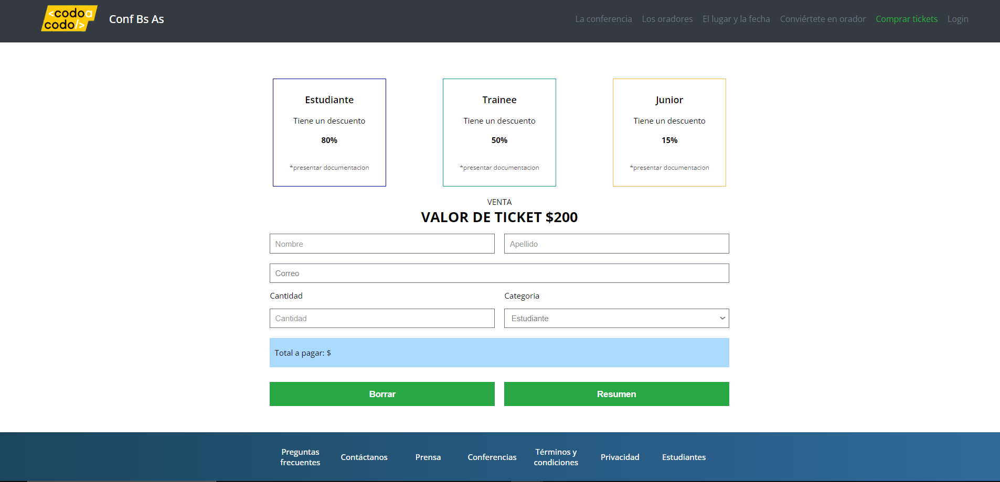
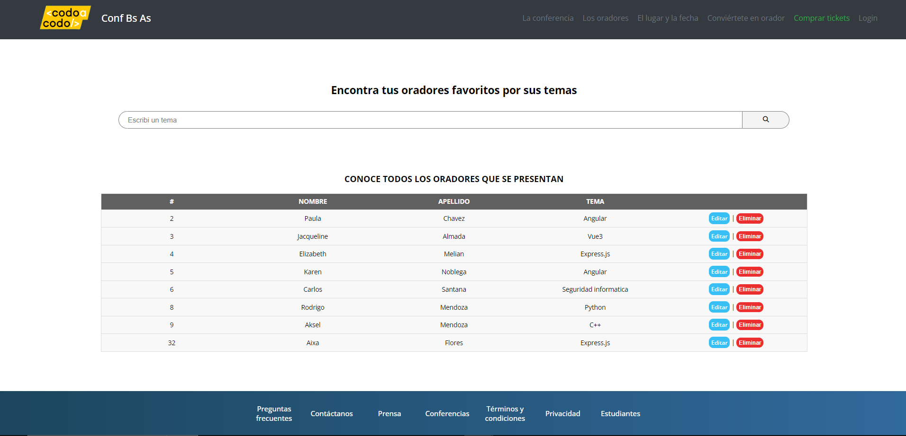

# Proyecto Final - Codo a Codo 2023
Comision: 23552

_En este proyecto final hacemos uso de todo lo aprendido dentro del cuatrimestre, haciendo una conexion entre el backend y frontend_

## Vista - Pagina de inicio

## Vista - Pagina de tickets

## Vista - Pagina administrativa de oradores

## Tecnologias usadas en este proyecto 🚀
#### Para el front-end:
&nbsp; &nbsp;  &nbsp;

#### Para el back-end:
&nbsp; &nbsp;

#### IDE utilizado:
&nbsp;

_Para poder visualizar la pagina hicimos uso de un servidor local: TOMCAT v.9_
